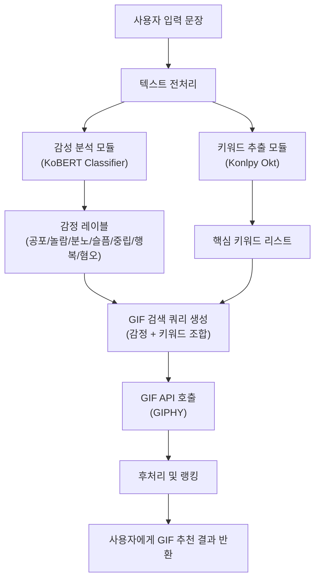

# BERT 기반 한국어 감성 분석·키워드 추출을 이용한 GIF 추천 시스템 개발

## 1. 프로젝트 개요
### 프로젝트 소개
본 프로젝트는 **KoBERT 기반 한국어 감정 분류 모델**과 **키워드 추출 로직**을 결합하여, 메신저 사용자의 입력 문장에 어울리는 **GIF를 자동으로 추천해주는 시스템**을 구현하는 것을 목표로 한다.

### 주제 선정 배경
카카오톡, 인스타그램과 같은 플랫폼 비즈니스는 사용자들이 서비스 안에 더 오래 머물고, 더 자주 상호작용하도록 만드는 것을 핵심 목표로 삼는다. 이러한 환경에서 사용자는 텍스트를 이용한 언어적 소통뿐만 아니라, 이모티콘·스티커·GIF와 같은 비언어적 표현 수단도 활발하게 사용한다. 최근 카카오톡에 도입된 이모티콘 추천 기능, 인스타그램 다이렉트 메시지(DM)의 GIPHY 연동 기능은 이러한 흐름을 잘 보여주는 대표적 사례다.

카카오톡의 이모티콘 추천 기능은 사용자가 입력한 문장을 분석해 이모티콘을 추천해 준다는 점에서 편의성과 대화 몰입도를 높이는 장점이 있다. 그러나 추천 대상이 카카오톡 내 유료 이모티콘에 제한된다는 한계가 있다. 이로 인해, 실제 사용자의 감정이나 상황에 더 잘 맞는 다양한 표현을 충분히 활용하기 어렵다.

반면 인스타그램 DM에 연동된 GIPHY는 방대한 양의 GIF를 제공하지만, 현재는 사용자가 직접 키워드를 검색하는 방식이고 대화 내용이나 감정 상태를 분석해 GIF를 추천해 주는 기능은 부재하다. 즉, 카카오톡은 추천 기능은 있으나 표현 수단과 범위가 제한적이고, GIPHY는 표현 수단은 풍부하지만 추천 인텔리전스가 부족한 상황인 것이다.

여기서 우리 팀은 사용자의 대화를 이해하고 그 속에 담긴 감정과 키워드를 파악한 뒤, 이를 기반으로 적절한 GIF를 자동으로 제안해 주는 시스템이 생긴다면 카카오톡과 인스타그램이 가진 장점을 결합하면서도 기존 한계를 보완할 수 있을 것이라고 생각했다. 이에 따라, 본 프로젝트에서는 BERT 기반 감정 분석과 키워드 추출 로직을 설계해 GIF를 추천하는 시스템을 설계하고 구현하는 것을 목표로 한다.

### 본 프로젝트의 차별점

- **대화 기반 자동 추천**  
  - 사용자가 메시지를 입력하면, 감정 분석+키워드 추출을 통해 자동으로 GIF 추천

- **세분화된 감정 기반 추천**  
  - 공포·놀람·분노·슬픔·중립·행복·혐오 7가지 감정을 구분해 상황에 더 잘 맞는 GIF 선택 가능

- **플랫폼·콘텐츠 제약 적음**  
  - 방대한 무료 GIF 리소스 자유롭게 활용 가능

- **한국어 대화 특화된 모델 사용**  
  - KoBERT 기반으로 한국어 문장을 이해하고 감정을 예측하는 모델 사용

## 2. 시스템 아키텍처



## 3. 데이터 & 전처리
### 사용한 데이터
- 한국어 감정 정보가 포함된 연속적 대화 데이터셋
(https://aihub.or.kr/aihubdata/data/view.do?dataSetSn=271)
- 감성 대화 말뭉치
(https://aihub.or.kr/aihubdata/data/view.do?dataSetSn=86)
- 한국어 혐오 표현 데이터셋
(https://github.com/smilegate-ai/korean_unsmile_dataset)

'한국어 감정 정보가 포함된 연속적 대화 데이터셋'만으로 감정 분류 모델을 학습하려고 했으나, 아래와 같이 특정 감정에 데이터가 쏠려 있는 클래스 불균형이 있어 추가 데이터(감성 대화 말뭉치, 혐오 표현 데이터셋)를 결합하기로 결정했다.


| 감정   | 개수   |
|--------|-------:|
| 행복   | 1,030  |
| 중립   | 43,786 |
| 슬픔   | 1,972  |
| 공포   | 98     |
| 혐오   | 220    |
| 분노   | 3,628  |
| 놀람   | 4,866  |

### 1) 연속적 대화 데이터셋 전처리

- 축약/오타 레이블 정리

```python
data3.replace('ㅍ', '공포', inplace=True)
data3.replace(['분', '분ㄴ'], '분노', inplace=True)
data3.replace(['ㅈ중립', '중림', 'ㄴ중립', '줄'], '분노', inplace=True)
```

- (Sentence, Emotion) 형태 정리

```python
data3.rename(columns={'Unnamed: 1': 'Sentence', 'Unnamed: 2': 'Emotion'}, inplace=True)
```

### 2) 감성 대화 말뭉치 전처리

- 불필요한 컬럼 제거

```python
corpus.drop(
    ['Unnamed: 0', '연령', '성별', '신체질환',
     '시스템문장1', '시스템문장2', '시스템문장3'],
    axis=1,
    inplace=True
)
```

- 감정_소분류 → 5개 감정 매핑
  - 행복

    `만족스러운`, `편안한`, `신뢰하는`, `안도`, `기쁨`, `감사하는`, `신이 난`, `자신하는`, `느긋` 등
  - 공포

    `혼란스러운`, `두려운`, `불안`, `초조한`, `당혹스러운` 등
  - 슬픔

    `좌절한`, `눈물이 나는`, `우울한`, `슬픔`, `상처`, `실망한`, `후회되는`, `비통한`, `낙담한`, `버려진`, `희생된`, `고립된` 등
  - 분노

    `짜증내는`, `분노`, `구역질 나는`, `환멸을 느끼는`, `악의적인`, `혐오스러운` 등
  - 중립

    코드 상에서 필요 없는/애매한 소분류를 제거하고, 나머지는 중립 문장으로 취급

- (Sentence, Emotion) 형태 정리

```python
corpus.drop(['상황키워드','감정_소분류','사람문장2', '사람문장3'], axis=1, inplace=True)

corpus.rename(columns={'감정_대분류': 'Emotion', '사람문장1': 'Sentence'}, inplace=True)

corpus = corpus[['Sentence', 'Emotion']]
corpus = corpus.reset_index(drop=True)
```

### 3) 혐오 표현 데이터셋 전처리

- 혐오 문장만 필터링

```python
data4 = data4[data4["혐오"] == 1]
```

- (Sentence, Emotion) 형태 정리

```python
data4 = data4[['문장', '혐오']]
data4.rename(columns={'문장': 'Sentence', '혐오': 'Emotion'}, inplace=True)
data4['Emotion'].loc[data4["Emotion"] == 1] = '혐오'
```

### 4) 데이터 결합

위의 데이터들을 결합하여 최종적으로 클래스 불균형을 완화한 통합 데이터프레임 `data`를 완성했다.

| 감정   | 개수   |
|--------|-------:|
| 행복   | 7,725  |
| 중립   | 40,813 |
| 슬픔   | 15,144 |
| 공포   | 6,226  |
| 혐오   | 11,457 |
| 분노   | 9,790  |
| 놀람   | 3,979  |

## 4. 모델 학습(진행 중)

- KoBERT
(https://github.com/SKTBrain/KoBERT#egg=kobert_tokenizer&subdirectory=kobert_hf')

```sh
pip install 'git+https://github.com/SKTBrain/KoBERT.git#egg=kobert_tokenizer&subdirectory=kobert_hf'
```


```python
target_classes ={
    '공포': 0,
    '놀람': 1,
    '분노': 2,
    '슬픔': 3,
    '중립': 4,
    '행복': 5,
    '혐오': 6
}

for cl in target_classes:
  df.loc[(df['Emotion'] == cl), 'Emotion'] = target_classes[cl]
```

```python
data_list =[]
for q, label in zip(df['Sentence'], df['Emotion']):
  data =[]
  data.append(q)
  data.append(str(label))

  data_list.append(data)
```


```python
class BERTSentenceTransform:
    def __init__(self, tokenizer, max_seq_length,
                 pad=True, pair=False):
        self._tokenizer = tokenizer
        self._max_seq_length = max_seq_length
        self._pad = pad
        self._pair = pair

        self.cls_token = self._tokenizer.cls_token or '[CLS]'
        self.sep_token = self._tokenizer.sep_token or '[SEP]'
        self.pad_token_id = self._tokenizer.pad_token_id

    def _truncate_seq_pair(self, tokens_a, tokens_b, max_length):
        while True:
            total_length = len(tokens_a) + len(tokens_b)
            if total_length <= max_length:
                break
            if len(tokens_a) > len(tokens_b):
                tokens_a.pop()
            else:
                tokens_b.pop()

    def __call__(self, line):
        # line: ['문장'] 또는 ['문장1', '문장2']
        text_a = line[0]
        if self._pair:
            assert len(line) == 2
            text_b = line[1]

        tokens_a = self._tokenizer.tokenize(text_a)
        tokens_b = None

        if self._pair:
            tokens_b = self._tokenizer.tokenize(text_b)

        # 길이 조정
        if tokens_b:
            # [CLS], [SEP], [SEP]
            self._truncate_seq_pair(tokens_a, tokens_b,
                                    self._max_seq_length - 3)
        else:
            # [CLS], [SEP]
            if len(tokens_a) > self._max_seq_length - 2:
                tokens_a = tokens_a[:self._max_seq_length - 2]

        tokens = []
        tokens.append(self.cls_token)
        tokens.extend(tokens_a)
        tokens.append(self.sep_token)
        segment_ids = [0] * len(tokens)

        if tokens_b:
            tokens.extend(tokens_b)
            tokens.append(self.sep_token)
            segment_ids.extend([1] * (len(tokens) - len(segment_ids)))

        input_ids = self._tokenizer.convert_tokens_to_ids(tokens)
        valid_length = len(input_ids)

        # 패딩
        if self._pad:
            padding_length = self._max_seq_length - valid_length
            input_ids.extend([self.pad_token_id] * padding_length)
            segment_ids.extend([0] * padding_length)

        return (np.array(input_ids, dtype='int32'),
                np.array(valid_length, dtype='int32'),
                np.array(segment_ids, dtype='int32'))
```

```python
class BERTDataset(Dataset):
    def __init__(self, dataset, sent_idx, label_idx,
                 bert_tokenizer, max_len,
                 pad=True, pair=False):

        transform = BERTSentenceTransform(
            bert_tokenizer,
            max_seq_length=max_len,
            pad=pad,
            pair=pair
        )
        self.sentences = [transform([i[sent_idx]]) for i in dataset]
        self.labels = [np.int32(i[label_idx]) for i in dataset]

    def __getitem__(self, i):
        return self.sentences[i] + (self.labels[i], )

    def __len__(self):
        return len(self.labels)
```

```python
tokenizer = KoBERTTokenizer.from_pretrained('skt/kobert-base-v1')
bertmodel = BertModel.from_pretrained('skt/kobert-base-v1')
```

```python

```

```python
class BERTClassifier(nn.Module):
    def __init__(self,
                 bert,
                 hidden_size=768,
                 num_classes=7,
                 dr_rate=None):
        super(BERTClassifier, self).__init__()
        self.bert = bert
        self.dr_rate = dr_rate

        self.classifier = nn.Linear(hidden_size, num_classes)
        if dr_rate:
            self.dropout = nn.Dropout(p=dr_rate)

    def gen_attention_mask(self, token_ids, valid_length):
        # token_ids: (batch_size, seq_len)
        attention_mask = torch.zeros_like(token_ids)
        for i, v in enumerate(valid_length):
            attention_mask[i][:v] = 1
        return attention_mask.float()

    def forward(self, token_ids, valid_length, segment_ids):
        attention_mask = self.gen_attention_mask(token_ids, valid_length)
        # transformers의 BertModel
        # return_dict=False → (sequence_output, pooled_output)
        _, pooler = self.bert(
            input_ids=token_ids,
            token_type_ids=segment_ids.long(),
            attention_mask=attention_mask.to(token_ids.device),
            return_dict=False
        )
        if self.dr_rate:
            out = self.dropout(pooler)
        else:
            out = pooler
        return self.classifier(out)
```


### 하이퍼파라미터

max_len = 100

batch_size = 64

warmup_ratio = 0.1

num_epochs = 3

max_grad_norm = 1

log_interval = 200

learning_rate =  5e-5

## 5. 개발 환경 및 기술 스택
