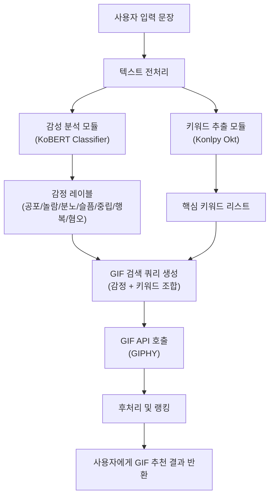

# BERT 기반 한국어 감성 분석·키워드 추출을 이용한 GIF 추천 시스템 개발

- 한양대학교 경영학부 박성헌(2018027074)
- 한양대학교 경영학부 인용건(2019078122)

## 0. 프로젝트 개요
### 프로젝트 소개
본 프로젝트는 **KoBERT/KoELECTRA 기반 한국어 감정 분류 모델**과 **키워드 추출 로직**을 결합하여, 메신저 사용자의 입력 문장에 어울리는 **GIF를 자동으로 추천해주는 시스템**을 구현하는 것을 목표로 한다.
<p align="center">
  
</p>
<p align="center">
  
</p>
### 주제 선정 배경
카카오톡, 인스타그램과 같은 플랫폼 비즈니스는 사용자들이 서비스 안에 더 오래 머물고, 더 자주 상호작용하도록 만드는 것을 핵심 목표로 삼는다. 이러한 환경에서 사용자는 텍스트를 이용한 언어적 소통뿐만 아니라, 이모티콘·스티커·GIF와 같은 비언어적 표현 수단도 활발하게 사용한다. 최근 카카오톡에 도입된 이모티콘 추천 기능, 인스타그램 다이렉트 메시지(DM)의 GIPHY 연동 기능은 이러한 흐름을 잘 보여주는 대표적 사례다.

카카오톡의 이모티콘 추천 기능은 사용자가 입력한 문장을 분석해 이모티콘을 추천해 준다는 점에서 편의성과 대화 몰입도를 높이는 장점이 있다. 그러나 추천 대상이 카카오톡 내 유료 이모티콘에 제한된다는 한계가 있다. 이로 인해, 실제 사용자의 감정이나 상황에 더 잘 맞는 다양한 표현을 충분히 활용하기 어렵다.

반면 인스타그램 DM에 연동된 GIPHY는 방대한 양의 GIF를 제공하지만, 현재는 사용자가 직접 키워드를 검색하는 방식이고 대화 내용이나 감정 상태를 분석해 GIF를 추천해 주는 기능은 부재하다. 즉, 카카오톡은 추천 기능은 있으나 표현 수단과 범위가 제한적이고, GIPHY는 표현 수단은 풍부하지만 추천 인텔리전스가 부족한 상황인 것이다.

여기서 우리 팀은 사용자의 대화를 이해하고 그 속에 담긴 감정과 키워드를 파악한 뒤, 이를 기반으로 적절한 GIF를 자동으로 제안해 주는 시스템이 생긴다면 카카오톡과 인스타그램이 가진 장점을 결합하면서도 기존 한계를 보완할 수 있을 것이라고 생각했다. 이에 따라, 본 프로젝트에서는 BERT/ELECTRA 기반 감정 분석과 키워드 추출 로직을 바탕으로 메신저 대화에 어울리는 GIF를 추천하는 시스템을 설계하고 구현하는 것을 목표로 한다.

### 본 프로젝트의 차별점

- **대화 기반 자동 추천**  
  - 사용자가 메시지를 입력하면, 감정 분석+키워드 추출을 통해 자동으로 GIF 추천

- **세분화된 감정 기반 추천**  
  - 공포·놀람·분노·슬픔·중립·행복·혐오 7가지 감정을 구분해 상황에 더 잘 맞는 GIF 선택 가능

- **플랫폼·콘텐츠 제약 적음**  
  - 방대한 무료 GIF 리소스 자유롭게 활용 가능

- **한국어 대화 특화된 모델 사용**  
  - KoBERT 기반으로 한국어 문장을 이해하고 감정을 예측하는 모델 사용

### 시스템 아키텍처



## 1. 데이터 & 전처리
### 사용한 데이터
- 한국어 감정 정보가 포함된 연속적 대화 데이터셋
(https://aihub.or.kr/aihubdata/data/view.do?dataSetSn=271)
- 감성 대화 말뭉치
(https://aihub.or.kr/aihubdata/data/view.do?dataSetSn=86)
- 한국어 혐오 표현 데이터셋
(https://github.com/smilegate-ai/korean_unsmile_dataset)

'한국어 감정 정보가 포함된 연속적 대화 데이터셋'만으로 감정 분류 모델을 학습하려고 했으나, 아래와 같이 특정 감정에 데이터가 쏠려 있는 클래스 불균형이 있어 추가 데이터(감성 대화 말뭉치, 혐오 표현 데이터셋)를 결합하기로 결정했다.


| 감정   | 개수   |
|--------|-------:|
| 행복   | 1,030  |
| 중립   | 43,786 |
| 슬픔   | 1,972  |
| 공포   | 98     |
| 혐오   | 220    |
| 분노   | 3,628  |
| 놀람   | 4,866  |

### 1) 연속적 대화 데이터셋 전처리

- 축약/오타 레이블 정리

```python
data3.replace('ㅍ', '공포', inplace=True)
data3.replace(['분', '분ㄴ'], '분노', inplace=True)
data3.replace(['ㅈ중립', '중림', 'ㄴ중립', '줄'], '분노', inplace=True)
```

- (Sentence, Emotion) 형태 정리

```python
data3.rename(columns={'Unnamed: 1': 'Sentence', 'Unnamed: 2': 'Emotion'}, inplace=True)
```

### 2) 감성 대화 말뭉치 전처리

- 불필요한 컬럼 제거

```python
corpus.drop(
    ['Unnamed: 0', '연령', '성별', '신체질환',
     '시스템문장1', '시스템문장2', '시스템문장3'],
    axis=1,
    inplace=True
)
```

- 감정_소분류 → 5개 감정 매핑
  - **행복**

    `만족스러운`, `편안한`, `신뢰하는`, `안도`, `기쁨`, `감사하는`, `신이 난`, `자신하는`, `느긋` 등
  - **공포**

    `혼란스러운`, `두려운`, `불안`, `초조한`, `당혹스러운` 등
  - **슬픔**

    `좌절한`, `눈물이 나는`, `우울한`, `슬픔`, `상처`, `실망한`, `후회되는`, `비통한`, `낙담한`, `버려진`, `희생된`, `고립된` 등
  - **분노**

    `짜증내는`, `분노`, `구역질 나는`, `환멸을 느끼는`, `악의적인`, `혐오스러운` 등
  - **중립**

    코드 상에서 필요 없는/애매한 소분류를 제거하고, 나머지는 중립 문장으로 취급

- (Sentence, Emotion) 형태 정리

```python
corpus.drop(['상황키워드','감정_소분류','사람문장2', '사람문장3'], axis=1, inplace=True)

corpus.rename(columns={'감정_대분류': 'Emotion', '사람문장1': 'Sentence'}, inplace=True)

corpus = corpus[['Sentence', 'Emotion']]
corpus = corpus.reset_index(drop=True)
```

### 3) 혐오 표현 데이터셋 전처리

- 혐오 문장만 필터링

```python
data4 = data4[data4["혐오"] == 1]
```

- (Sentence, Emotion) 형태 정리

```python
data4 = data4[['문장', '혐오']]
data4.rename(columns={'문장': 'Sentence', '혐오': 'Emotion'}, inplace=True)
data4['Emotion'].loc[data4["Emotion"] == 1] = '혐오'
```

### 4) 데이터 결합

위의 데이터들을 결합하여 최종적으로 클래스 불균형을 완화한 통합 데이터프레임 `data`를 완성했다.

| 감정   | 개수   |
|--------|-------:|
| 행복   | 7,725  |
| 중립   | 40,813 |
| 슬픔   | 15,144 |
| 공포   | 6,226  |
| 혐오   | 11,457 |
| 분노   | 9,790  |
| 놀람   | 3,979  |

## 2. 모델 학습

### 1) KoBERT 기반 감정 분류 모델
전처리된 통합 데이터셋(data.csv)을 바탕으로, 먼저 KoBERT 기반 한국어 감정 분류 모델을 전형적인 파인튜닝 구조를 통해 학습했다. SKTBrain에서 공개한 KoBERT는 한국어 위키 문장 약 500만 개와 한국어 뉴스 문장 약 2,000만 개를 학습한 모델로, 일반 BERT에 비해 한국어 문장 이해 성능이 우수하며, 단순 긍·부정 이진 분류가 아니라 여러 감정으로의 다중 분류에도 적합하다고 평가된다. 본 프로젝트에서는 HuggingFace Hub에 공개된 skt/kobert-base-v1 체크포인트를 사용하며, 의존성 문제를 해결하고 최신 환경에서도 안정적으로 동작하도록 하기 위해 기존 MXNet/GluonNLP 기반 구현을 HuggingFace 기반 토크나이저로 대체하고 vocab 구조를 직접 받아오는 BertModel + PyTorch 구조로 재구성했다.
- KoBERT
(https://github.com/SKTBrain/KoBERT)

```sh
pip install 'git+https://github.com/SKTBrain/KoBERT.git#egg=kobert_tokenizer&subdirectory=kobert_hf'
```

- 학습을 진행하기 위해 감정 레이블을 0~6의 정수로 매핑하고 train_test_split을 이용해 학습/검증 데이터를 8:2 비율로 나누었다. 이때 각 감정 클래스의 분포가 학습/검증 셋에서 비슷하게 유지되도록 stratify 옵션을 사용했다.
```python
target_classes = {
    '공포': 0,
    '놀람': 1,
    '분노': 2,
    '슬픔': 3,
    '중립': 4,
    '행복': 5,
    '혐오': 6
}
id2label = {v: k for k, v in target_classes.items()}
num_labels = len(target_classes)

if df['emotion'].dtype == object:
    df['emotion'] = df['emotion'].map(target_classes).astype(int)
```

```python
train_df, valid_df = train_test_split(
    df,
    test_size=0.2,
    random_state=42,
    stratify=df['emotion']
)
```

- KoBERT는 단순 문자열이 아니라 input_ids, segment_ids, valid_length 형태의 텐서를 입력으로 받기 때문에, 이를 자동으로 만들어 주는 BERTSentenceTransform 클래스를 구현하였다. BERTSentenceTransform 클래스는 하나의 문장을 토크나이저로 토큰화한 뒤, [CLS]와 [SEP] 토큰을 붙이고, 최대 길이(max_seq_length)를 넘는 부분을 잘라낸 다음, 부족한 부분은 PAD 토큰으로 채워서 고정 길이 시퀀스로 만드는 역할을 한다. 즉, 한 문장을 KoBERT가 바로 받을 수 있는 토큰 ID 시퀀스로 변환해주는 역할을 한다.
```python
class BERTSentenceTransform:
    def __init__(self, tokenizer, max_seq_length,
                 pad=True, pair=False):
        self._tokenizer = tokenizer
        self._max_seq_length = max_seq_length
        self._pad = pad
        self._pair = pair

        self.cls_token = self._tokenizer.cls_token or '[CLS]'
        self.sep_token = self._tokenizer.sep_token or '[SEP]'
        self.pad_token_id = self._tokenizer.pad_token_id

    def _truncate_seq_pair(self, tokens_a, tokens_b, max_length):
        while True:
            total_length = len(tokens_a) + len(tokens_b)
            if total_length <= max_length:
                break
            if len(tokens_a) > len(tokens_b):
                tokens_a.pop()
            else:
                tokens_b.pop()

    def __call__(self, line):
        text_a = line[0]
        tokens_a = self._tokenizer.tokenize(text_a)
        tokens_b = None

        if self._pair:
            assert len(line) == 2
            text_b = line[1]
            tokens_b = self._tokenizer.tokenize(text_b)

        if tokens_b:
            self._truncate_seq_pair(tokens_a, tokens_b,
                                    self._max_seq_length - 3)
        else:
            if len(tokens_a) > self._max_seq_length - 2:
                tokens_a = tokens_a[:self._max_seq_length - 2]

        tokens = []
        tokens.append(self.cls_token)
        tokens.extend(tokens_a)
        tokens.append(self.sep_token)
        segment_ids = [0] * len(tokens)

        if tokens_b:
            tokens.extend(tokens_b)
            tokens.append(self.sep_token)
            segment_ids.extend([1] * (len(tokens) - len(segment_ids)))

        input_ids = self._tokenizer.convert_tokens_to_ids(tokens)
        valid_length = len(input_ids)

        if self._pad:
            padding_length = self._max_seq_length - valid_length
            input_ids.extend([self.pad_token_id] * padding_length)
            segment_ids.extend([0] * padding_length)

        return (np.array(input_ids, dtype='int32'),
                np.array(valid_length, dtype='int32'),
                np.array(segment_ids, dtype='int32'))
```

- BERTDataset 클래스는 학습용 데이터 구조를 PyTorch DataLoader에 바로 입력 가능한 형태로 만들기 위해 [sentence, label] 구조의 리스트를 받아, 각 문장을 BERTSentenceTransform으로 변환하고 PyTorch Dataset 형태로 감싸는 역할을 한다.
```python
class BERTDataset(Dataset):
    def __init__(self, dataset, sent_idx, label_idx,
                 bert_tokenizer, max_len,
                 pad=True, pair=False):

        transform = BERTSentenceTransform(
            bert_tokenizer,
            max_seq_length=max_len,
            pad=pad,
            pair=pair
        )
        self.sentences = [transform([i[sent_idx]]) for i in dataset]
        self.labels = [np.int32(i[label_idx]) for i in dataset]

    def __getitem__(self, i):
        return self.sentences[i] + (self.labels[i], )

    def __len__(self):
        return len(self.labels)
```

- 실제 데이터로부터 KoBERT 토크나이저와 사전학습된 BertModel을 불러온 뒤, 전처리된 데이터프레임을 기반으로 배치 단위 학습/검증용 DataLoader를 구성하는 코드는 다음과 같다.
```python
# KoBERT 토크나이저 & 모델
tokenizer_kobert = KoBERTTokenizer.from_pretrained('skt/kobert-base-v1')
bertmodel_kobert = BertModel.from_pretrained('skt/kobert-base-v1')

data_list_train = [
    [q, str(l)] for q, l in zip(train_df['sentence'], train_df['emotion'])
]
data_list_valid = [
    [q, str(l)] for q, l in zip(valid_df['sentence'], valid_df['emotion'])
]

data_train = BERTDataset(data_list_train, 0, 1, tokenizer_kobert, max_len_kobert, pad=True, pair=False)
data_valid = BERTDataset(data_list_valid, 0, 1, tokenizer_kobert, max_len_kobert, pad=True, pair=False)

train_dataloader_kobert = DataLoader(
    data_train,
    batch_size=batch_size_kobert,
    num_workers=0,
    shuffle=True
)
valid_dataloader_kobert = DataLoader(
    data_valid,
    batch_size=batch_size_kobert,
    num_workers=0,
    shuffle=False
)
```

- KoBERT 기반 감정 분류 모델은 사전학습된 BertModel 위에 단일 선형 분류 레이어를 올려 7개 감정 클래스를 예측하는 구조로 설계했다. 사전학습된 KoBERT에서 CLS 위치의 pooled_output을 가져와 Dropout으로 과적합을 완화하고 정규화한 뒤 최종 7차원으로 투영하는 과정을 정의하며, softmax를 적용해 각 감정 클래스에 대한 확률을 얻도록 하는 역할을 한다.
```python
class BERTClassifier(nn.Module):
    def __init__(self,
                 bert,
                 hidden_size=768,
                 num_classes=7,
                 dr_rate=None):
        super(BERTClassifier, self).__init__()
        self.bert = bert
        self.dr_rate = dr_rate

        self.classifier = nn.Linear(hidden_size, num_classes)
        if dr_rate:
            self.dropout = nn.Dropout(p=dr_rate)

    def gen_attention_mask(self, token_ids, valid_length):
        attention_mask = torch.zeros_like(token_ids)
        for i, v in enumerate(valid_length):
            attention_mask[i][:v] = 1
        return attention_mask.float()

    def forward(self, token_ids, valid_length, segment_ids):
        attention_mask = self.gen_attention_mask(token_ids, valid_length)
        _, pooler = self.bert(
            input_ids=token_ids,
            token_type_ids=segment_ids.long(),
            attention_mask=attention_mask.to(token_ids.device),
            return_dict=False
        )
        if self.dr_rate:
            out = self.dropout(pooler)
        else:
            out = pooler
        return self.classifier(out)
```

- 학습에 사용한 주요 하이퍼파라미터는 다음과 같다.
```python
max_len_kobert = 100
batch_size_kobert = 64
warmup_ratio = 0.1
num_epochs_kobert = 1
max_grad_norm = 1
log_interval = 200
learning_rate_kobert = 5e-5

kobert_model = BERTClassifier(bertmodel_kobert, dr_rate=0.5).to(device_kobert)
```

- 옵티마이저는 BERT 계열 파인튜닝에서 표준적으로 사용하는 AdamW를 사용하고, AdamW + weight decay + cosine LR scheduler + warmup 조합을 통해 학습 초기에는 학습률을 점진적으로 증가시키고, 이후에는 점차 감소시키면서 안정적인 파인튜닝을 유도하도록 설계하였다.
```python
no_decay = ['bias', 'LayerNorm.weight']
optimizer_grouped_parameters = [
    {
        'params': [p for n, p in kobert_model.named_parameters()
                   if not any(nd in n for nd in no_decay)],
        'weight_decay': 0.01
    },
    {
        'params': [p for n, p in kobert_model.named_parameters()
                   if any(nd in n for nd in no_decay)],
        'weight_decay': 0.0
    }
]

optimizer_kobert = AdamW(optimizer_grouped_parameters, lr=learning_rate_kobert)
loss_fn_kobert = nn.CrossEntropyLoss()

t_total = len(train_dataloader_kobert) * num_epochs_kobert
warmup_step = int(t_total * warmup_ratio)

scheduler_kobert = get_cosine_schedule_with_warmup(
    optimizer_kobert,
    num_warmup_steps=warmup_step,
    num_training_steps=t_total
)
```

- 학습 루프는 에폭 단위로 반복되며, 각 에폭에서 학습 단계와 검증 단계를 순차적으로 수행한다. 각 에폭이 끝난 뒤에는 eval() 모드에서 검증 데이터를 한 번 더 통과시켜 validation accuracy를 계산하고, train_history와 valid_history에 기록하여 이후 학습 곡선을 시각화할 수 있다.
```python
train_history = []
valid_history = []
loss_history = []

for epoch in range(num_epochs_kobert):
    kobert_model.train()
    train_acc = 0.0
    batch_count = 0
    print(f"\n===== KoBERT Epoch {epoch+1} / {num_epochs_kobert} =====")

    for batch_id, (token_ids, valid_length, segment_ids, label) in enumerate(tqdm(train_dataloader_kobert)):
        optimizer_kobert.zero_grad()

        token_ids = token_ids.long().to(device_kobert)
        segment_ids = segment_ids.long().to(device_kobert)
        valid_length = valid_length
        label = label.long().to(device_kobert)

        logits = kobert_model(token_ids, valid_length, segment_ids)
        loss = loss_fn_kobert(logits, label)

        loss.backward()
        nn.utils.clip_grad_norm_(kobert_model.parameters(), max_grad_norm)
        optimizer_kobert.step()
        scheduler_kobert.step()

        batch_acc = calc_accuracy(logits, label)
        train_acc += batch_acc
        batch_count += 1

        if batch_id % log_interval == 0:
            print(f"Epoch {epoch+1} Batch {batch_id+1} "
                  f"Loss {loss.item():.4f} Train Acc {train_acc / batch_count:.4f}")

        train_history.append(train_acc / batch_count)
        loss_history.append(loss.item())

    print(f"Epoch {epoch+1} Train Acc: {train_acc / batch_count:.4f}")

    # ----- 검증 -----
    kobert_model.eval()
    valid_acc = 0.0
    valid_batch_count = 0
    with torch.no_grad():
        for batch_id, (token_ids, valid_length, segment_ids, label) in enumerate(tqdm(valid_dataloader_kobert)):
            token_ids = token_ids.long().to(device_kobert)
            segment_ids = segment_ids.long().to(device_kobert)
            valid_length = valid_length
            label = label.long().to(device_kobert)

            logits = kobert_model(token_ids, valid_length, segment_ids)
            batch_acc = calc_accuracy(logits, label)
            valid_acc += batch_acc
            valid_batch_count += 1

    print(f"Epoch {epoch+1} Valid Acc: {valid_acc / valid_batch_count:.4f}")
    valid_history.append(valid_acc / valid_batch_count)
```

- 학습이 끝나면, 추후 Streamlit 앱에서 재사용할 수 있도록 가중치를 저장한다. 이렇게 저장된 .pt 파일은 app.py에서 로드하여, 실제 사용자 입력에 대한 실시간 감정 분석 및 GIF 추천에 활용된다.
```python
torch.save(kobert_model.state_dict(), "./kobert_emotion_model_state_dict.pt")
print("모델 가중치 저장 완료: kobert_emotion_model_state_dict.pt")
```

### 2) KoELECTRA 기반 감정 분류 모델
본 프로젝트에서는 KoBERT와 더불어, 한국어에 특화된 사전학습 언어모델인 KoELECTRA 또한 함께 실험했다. KoELECTRA는 ELECTRA 구조를 기반으로 한 한국어 모델로 BERT 대비 학습 효율이 높고, 다양한 한국어 다운스트림 태스크에서 강한 성능을 보이는 것으로 알려져 있다. 따라서 동일한 감정 분류 데이터셋에 대해 KoBERT와 KoELECTRA를 각각 파인튜닝하고, 두 모델의 성능을 비교하는 실험을 진행했다.

- KoELECTRA (https://github.com/monologg/KoELECTRA)

- KoELECTRA와 같은 HuggingFace 기반 모델이 학습할 수 있도록, 문장과 감정 레이블을 모델 입력 포맷으로 변환하는 EmotionDataset 클래스를 정의했다. HuggingFace 모델은 단순 문자열을 바로 입력받지 못하고, 반드시 input_ids, attention_mask, token_type_ids 형태의 텐서를 입력으로 받아야 한다. 따라서 이 데이터셋 클래스는 토크나이저를 이용해 각 문장을 해당 구조로 자동 변환하고, 레이블도 PyTorch 텐서로 함께 반환한다.
```python
class EmotionDataset(Dataset):
    def __init__(self, sentences, labels, tokenizer, max_len=64):
        self.sentences = sentences.reset_index(drop=True)
        self.labels = labels.reset_index(drop=True)
        self.tokenizer = tokenizer
        self.max_len = max_len

    def __len__(self):
        return len(self.sentences)

    def __getitem__(self, idx):
        sentence = str(self.sentences.iloc[idx])
        label = int(self.labels.iloc[idx])

        encoded = self.tokenizer(
            sentence,
            padding='max_length',
            truncation=True,
            max_length=self.max_len,
            return_tensors='pt'
        )

        item = {k: v.squeeze(0) for k, v in encoded.items()}
        item['labels'] = torch.tensor(label, dtype=torch.long)
        return item
```

- evaluate_hf() 함수는 학습된 모델의 성능을 평가하기 위한 유틸리티로, 주어진 dataloader를 순회하며 예측값과 실제값을 비교하여 accuracy와 macro F1-score를 계산한다.
```python
def evaluate_hf(model, dataloader, device):
    model.eval()
    preds, trues = [], []

    with torch.no_grad():
        for batch in dataloader:
            batch = {k: v.to(device) for k, v in batch.items()}
            outputs = model(**batch)
            logits = outputs.logits
            pred = torch.argmax(logits, dim=-1)

            preds.extend(pred.cpu().tolist())
            trues.extend(batch['labels'].cpu().tolist())

    acc = accuracy_score(trues, preds)
    macro_f1 = f1_score(trues, preds, average='macro')
    return acc, macro_f1, np.array(trues), np.array(preds)
```

- train_one_model()은 HuggingFace 모델을 실제로 학습시키는 함수로, 토크나이저 로드 → 데이터셋/데이터로더 구성 → 학습 루프 실행 → validation 평가 과정으로 이루어진다. 이 함수는 최종적으로 학습된 모델, 토크나이저, best accuracy, best F1-score를 반환한다. 이 구성은 이후 KoELECTRA 학습·평가 단계의 기반 역할을 한다.
```python
def train_one_model(model_name, train_df, valid_df, num_labels, alias=None, epochs=1, batch_size=32, lr=2e-5, max_len=64, device_override=None):
    if alias is None:
        alias = model_name
    print(f"\n=== 모델: {alias} ({model_name}) ===")

    if device_override is not None:
        dev = torch.device(device_override)
    else:
        dev = torch.device("cuda" if torch.cuda.is_available() else "cpu")
    print("사용 device:", dev)

    assert train_df['emotion'].min() >= 0 and train_df['emotion'].max() < num_labels
    assert valid_df['emotion'].min() >= 0 and valid_df['emotion'].max() < num_labels

    # 토크나이저 & 모델 로드
    tokenizer = AutoTokenizer.from_pretrained(model_name, use_fast=False)
    model = AutoModelForSequenceClassification.from_pretrained(
        model_name,
        num_labels=num_labels
    )

    model.resize_token_embeddings(len(tokenizer))
    model.to(dev)

    print("tokenizer vocab_size:", len(tokenizer))
    print("input embedding size:", model.get_input_embeddings().weight.shape)

    train_dataset = EmotionDataset(
        train_df['sentence'],
        train_df['emotion'],
        tokenizer,
        max_len=max_len
    )
    valid_dataset = EmotionDataset(
        valid_df['sentence'],
        valid_df['emotion'],
        tokenizer,
        max_len=max_len
    )

    train_loader = DataLoader(train_dataset, batch_size=batch_size, shuffle=True)
    valid_loader = DataLoader(valid_dataset, batch_size=batch_size, shuffle=False)

    optimizer = AdamW(model.parameters(), lr=lr)

    best_acc = 0.0
    best_f1 = 0.0

    for epoch in range(1, epochs + 1):
        model.train()
        total_loss = 0.0
        loop = tqdm(train_loader, desc=f"Epoch {epoch}")

        for batch in loop:
            batch = {k: v.to(dev) for k, v in batch.items()}

            outputs = model(**batch)
            loss = outputs.loss

            optimizer.zero_grad()
            loss.backward()
            optimizer.step()

            total_loss += loss.item()
            loop.set_postfix(loss=loss.item())

        val_acc, val_f1, _, _ = evaluate_hf(model, valid_loader, dev)
        avg_loss = total_loss / len(train_loader)
        print(f"[Epoch {epoch}] loss: {avg_loss:.4f}, val_acc: {val_acc:.4f}, val_macro_f1={val_f1:.4f}")

        if val_acc > best_acc:
            best_acc = val_acc
            best_f1 = val_f1

    print(f"=== {alias} 최종 성능: acc={best_acc:.4f}, macro_f1={best_f1:.4f} ===")
    return best_acc, best_f1, model, tokenizer
```

- 사전학습된 KoELECTRA-base-v3-discriminator 모델을 사용해 감정 분류 작업에 맞게 파인튜닝을 수행한다. train_one_model() 함수는 주어진 학습 데이터(train_df)와 검증 데이터(valid_df)를 입력받아 모델을 한 epoch 동안 학습시키고, 최종적으로 Validation Accuracy와 Macro F1-score, 그리고 학습이 완료된 모델과 토크나이저 객체를 반환한다. 학습이 완료되면, 모델은(validation 기준) 감정 분류 정확도와 F1-score가 출력되며, 이후 실사용을 위한 예측 함수를 사용하여 문장 감정 분석을 수행할 수 있다.
```python
acc_koel, f1_koel, model_koel, tokenizer_koel = train_one_model(
    model_name="monologg/koelectra-base-v3-discriminator",
    alias="KoELECTRA",
    train_df=train_df,
    valid_df=valid_df,
    num_labels=num_labels,
    epochs=1,
    batch_size=32,
    lr=2e-5,
    max_len=64
)

print("KoELECTRA 성능 → acc:", acc_koel, "macro_f1:", f1_koel)
```

- 기본 예측 함수인 predict_emotion_hf()는 입력 문장을 토크나이저로 인코딩한 뒤, KoELECTRA 모델에 전달하여 감정별 로짓(logit)을 계산한다. KoELECTRA에서도 모델 출력값은 softmax를 통해 확률로 변환되며, 가장 높은 확률을 가진 감정 클래스가 최종 예측 결과로 선택된다.
```python
def predict_emotion_hf(sentence, model, tokenizer, id2label, max_len=64):
    model.eval()
    dev = next(model.parameters()).device

    encoded = tokenizer(
        sentence,
        return_tensors='pt',
        truncation=True,
        padding='max_length',
        max_length=max_len
    )
    encoded = {k: v.to(dev) for k, v in encoded.items()}

    with torch.no_grad():
        outputs = model(**encoded)
        logits = outputs.logits
        probs = torch.softmax(logits, dim=-1)[0]
        pred_id = int(torch.argmax(probs))

    pred_label = id2label[pred_id]
    return pred_id, pred_label, probs.cpu().numpy()
```

- 문장을 입력하면 모델에 전달되어 감정을 예측하고, 예측된 감정 레이블과 감정별 확률을 함께 출력한다. 출력된 결과를 통해 모델이 특정 문장을 어떻게 해석하는지 직관적으로 확인할 수 있다.
```python
test_sent = "오늘 저녁은 치킨이닭"
pred_id, pred_label, probs = predict_emotion_hf(
    test_sent,
    model_koel,
    tokenizer_koel,
    id2label
)

print("입력 문장:", test_sent)
print("예측 감정 코드:", pred_id)
print("예측 감정 이름:", pred_label)
print("각 감정별 확률:", probs)
```

- 학습이 끝나면, 추후 Streamlit 앱에서 재사용할 수 있도록 가중치를 저장한다. 이렇게 저장된 .pt 파일은 app.py에서 로드하여, 실제 사용자 입력에 대한 실시간 감정 분석 및 GIF 추천에 활용된다.
```python
torch.save(model_koel.state_dict(), "./koelectra_emotion_model_state_dict.pt")
print("저장 완료: koelectra_emotion_model_state_dict.pt")
```

## 3. 모델 평가

### 1) KoBERT 기반 감정 분류 모델
이 단계에서는 학습이 완료된 KoBERT 감정 분류 모델의 성능을 정량적으로 평가하고, 각 감정 클래스별로 어떤 유형의 오분류가 발생하는지 분석한다. 이를 통해 KoBERT가 어떤 감정에 강점이 있고, 어떤 감정에서 상대적으로 취약한지 확인하여 이후 데이터 보완이나 모델 개선 방향을 설정할 수 있다.

- 먼저 KoBERT 전용 입력 포맷을 사용하는 BERTDataset과 학습 시에 사용했던 valid_dataloader_kobert를 그대로 활용하고, 별도의 평가 함수 evaluate_kobert()를 정의하여 accuracy 및 macro F1-score를 계산한다. 이 함수는 DataLoader를 순회하면서 실제 라벨과 예측 라벨을 수집한 뒤, scikit-learn의 accuracy_score와 f1_score를 이용해 전체 성능을 산출하고, 향후 혼동행렬과 분류 리포트 생성을 위해 y_true, y_pred도 함께 반환한다.
```python
def evaluate_kobert(model, dataloader, device):
    model.eval()
    preds, trues = [], []

    with torch.no_grad():
        for token_ids, valid_length, segment_ids, label in dataloader:
            token_ids = token_ids.long().to(device)
            segment_ids = segment_ids.long().to(device)
            vlen = valid_length
            label = label.long().to(device)

            logits = model(token_ids, vlen, segment_ids)
            pred = torch.argmax(logits, dim=-1)

            preds.extend(pred.cpu().tolist())
            trues.extend(label.cpu().tolist())

    acc = accuracy_score(trues, preds)
    macro_f1 = f1_score(trues, preds, average='macro')
    return acc, macro_f1, np.array(trues), np.array(preds)


kobert_acc, kobert_f1, y_true_kobert, y_pred_kobert = evaluate_kobert(
    kobert_model,
    valid_dataloader_kobert,
    device_kobert
)

print("=== KoBERT Valid 성능 ===")
print("accuracy:", kobert_acc)
print("macro F1:", kobert_f1)
```

- 이후 classification_report()를 이용해 7개 감정 클래스(공포, 놀람, 분노, 슬픔, 중립, 행복, 혐오)에 대해 precision, recall, F1-score를 출력함으로써, KoBERT가 특정 감정에 더 강하거나 약한지 세부적으로 분석할 수 있다. 또한 confusion_matrix()를 사용해 실제 라벨과 예측 라벨의 조합을 행렬 형태로 출력하고, 이를 Matplotlib을 활용해 혼동행렬 이미지로 시각화한다. 마지막으로, classification_report 결과를 딕셔너리 형태로 받아 각 감정 클래스별 F1-score만 추출한 뒤, 막대 그래프로 시각화한다.
```python
sorted_items = sorted(target_classes.items(), key=lambda x: x[1])
target_names_kobert = [k for k, v in sorted_items]

print("\n=== KoBERT 감정별 분류 리포트 ===")
print(classification_report(
    y_true_kobert,
    y_pred_kobert,
    target_names=target_names_kobert
))

cm_kobert = confusion_matrix(y_true_kobert, y_pred_kobert)
print("=== KoBERT 혼동행렬 (행: 실제, 열: 예측) ===")
print(cm_kobert)

plt.rcParams['axes.unicode_minus'] = False

plt.figure(figsize=(8, 6))
plt.imshow(cm_kobert)
plt.title("KoBERT Confusion Matrix")
plt.xlabel("Predicted")
plt.ylabel("True")
plt.xticks(ticks=np.arange(len(target_names_kobert)), labels=target_names_kobert, rotation=45)
plt.yticks(ticks=np.arange(len(target_names_kobert)), labels=target_names_kobert)
plt.colorbar()
plt.tight_layout()
plt.show()

report_dict_kobert = classification_report(
    y_true_kobert,
    y_pred_kobert,
    target_names=target_names_kobert,
    output_dict=True
)

labels_kobert = target_names_kobert
f1_scores_kobert = [report_dict_kobert[label]["f1-score"] for label in labels_kobert]

plt.figure(figsize=(10, 5))
plt.bar(labels_kobert, f1_scores_kobert)
plt.title("KoBERT Per-Class F1-score")
plt.xlabel("Emotion")
plt.ylabel("F1-score")
plt.ylim(0, 1.05)
plt.grid(axis="y", linestyle="--", alpha=0.5)
plt.tight_layout()
plt.show()
```

KoBERT 기반 감정 분류 모델은 검증 데이터에서 약 80.38%의 정확도와 0.72 수준의 macro F1-score를 기록하며, 전반적으로 KoELECTRA와 유사한 수준의 안정적인 성능을 보여주었다. 감정별 성능을 살펴보면, ‘중립’, ‘행복’, ‘혐오’ 감정에서 특히 우수한 결과를 확인할 수 있으며, 그 중에서도 ‘혐오’는 F1-score가 0.97로 거의 완벽에 가까운 분류 성능을 보였다. 반면, ‘놀람’과 ‘공포’, ‘분노’ 등 일부 감정은 상대적으로 성능이 떨어지는 편이다. 특히 ‘놀람’의 F1-score는 0.44, ‘공포’는 0.62, ‘분노’는 0.60으로, 유사한 정서적 톤을 가진 다른 부정 감정(슬픔, 분노, 공포 등)과 혼동되는 양상이 드러난다.

### 2) KoELECTRA 기반 감정 분류 모델
이 단계에서는 학습이 완료된 KoELECTRA 감정 분류 모델의 성능을 정량적으로 평가하고, 각 감정 클래스별로 어떤 패턴의 오분류가 발생하는지 분석한다.

- 먼저 EmotionDataset을 활용해 학습 데이터와 검증 데이터를 각각 train_set_koel, valid_set_koel로 구성한 뒤, 이를 기반으로 DataLoader를 생성한다. 이를 통해 학습 데이터(train)와 검증 데이터(valid) 각각에 대해 성능을 측정하고, results_df 데이터프레임으로 정리해 한눈에 비교할 수 있도록 한다.
```python
def evaluate_with_preds(model, dataloader, device):
    return evaluate_hf(model, dataloader, device)

max_len = 64
batch_size = 32

train_set_koel = EmotionDataset(train_df['sentence'], train_df['emotion'], tokenizer_koel, max_len=max_len)
valid_set_koel = EmotionDataset(valid_df['sentence'], valid_df['emotion'], tokenizer_koel, max_len=max_len)

train_loader_koel = DataLoader(train_set_koel, batch_size=batch_size, shuffle=False)
valid_loader_koel = DataLoader(valid_set_koel, batch_size=batch_size, shuffle=False)

train_acc_koel, train_f1_koel, _, _ = evaluate_with_preds(model_koel, train_loader_koel, device)
valid_acc_koel, valid_f1_koel, y_true_koel, y_pred_koel = evaluate_with_preds(model_koel, valid_loader_koel, device)

results_df = pd.DataFrame([
    ["KoELECTRA-train", train_acc_koel, train_f1_koel],
    ["KoELECTRA-valid", valid_acc_koel, valid_f1_koel],
], columns=["split", "accuracy", "macro_f1"])

print("=== KoELECTRA split별 성능 ===")
print(results_df)
```

- 추가로, classification_report()를 사용해 7개 감정 클래스(공포, 놀람, 분노, 슬픔, 중립, 행복, 혐오)에 대해 precision, recall, F1-score를 출력함으로써, 어떤 감정에서 상대적으로 성능이 떨어지는지 세부적으로 확인할 수 있다. confusion_matrix()는 실제 라벨과 예측 결과의 조합을 행렬 형태로 제공하며, 이를 Matplotlib을 이용해 시각화함으로써 어떤 감정이 다른 감정으로 자주 오분류되는지를 직관적으로 파악할 수 있다. 마지막으로, classification_report의 결과를 각 감정 클래스별 F1-score의 막대 그래프로 시각화한다. 이 그래프는 모델이 특정 감정에 대해 상대적으로 강한지 혹은 약한지를 한눈에 보여주며, 이후 데이터 보완이나 모델 개선 방향을 설계하는 데 중요한 기준으로 활용될 수 있다.
```python
target_names = ["공포", "놀람", "분노", "슬픔", "중립", "행복", "혐오"]

print("\n=== KoELECTRA 감정별 분류 리포트 ===")
print(classification_report(y_true_koel, y_pred_koel, target_names=target_names))

cm_koel = confusion_matrix(y_true_koel, y_pred_koel)

print("=== KoELECTRA 혼동행렬 (행: 실제, 열: 예측) ===")
print(cm_koel)

plt.figure(figsize=(8, 6))
plt.imshow(cm_koel)
plt.title("KoELECTRA Confusion Matrix")
plt.xlabel("Predicted")
plt.ylabel("True")
plt.xticks(ticks=np.arange(len(target_names)), labels=target_names, rotation=45)
plt.yticks(ticks=np.arange(len(target_names)), labels=target_names)
plt.colorbar()
plt.tight_layout()
plt.show()

report_dict_koel = classification_report(
    y_true_koel,
    y_pred_koel,
    target_names=target_names,
    output_dict=True
)

f1_scores_koel = [report_dict_koel[label]["f1-score"] for label in target_names]

plt.figure(figsize=(10, 5))
plt.bar(target_names, f1_scores_koel)
plt.title("KoELECTRA Per-Class F1-score")
plt.xlabel("Emotion")
plt.ylabel("F1-score")
plt.ylim(0, 1.05)
plt.grid(axis="y", linestyle="--", alpha=0.5)
plt.tight_layout()
plt.show()
```

KoELECTRA 감정 분류 모델은 전체 검증 데이터 기준 약 81%의 정확도와 0.72의 macro F1-score를 보여, 7개 감정 클래스 전반에 걸쳐 비교적 안정적이고 균형 잡힌 성능을 확인할 수 있었다. 특히 ‘중립’, ‘행복’, ‘혐오’와 같이 표현적 특성이 뚜렷하거나 데이터가 충분한 클래스에서는 높은 정밀도와 재현율을 보이며 강한 분류 성능을 나타냈다. 반면, ‘놀람’과 같은 일부 감정 클래스는 재현율이 낮아 다른 감정(특히 중립)으로 오분류되는 경향이 있었다.

### 3) KoBERT, KoELECTRA 두 모델 성능 비교

학습된 두 모델의 성능을 종합해 봤을 때, KoELECTRA는 검증 정확도 81.16%, macro F1-score 0.715를 기록했으며, KoBERT는 정확도 80.38%, macro F1-score 0.723를 보였다. 정확도는 KoELECTRA가 약간 앞서지만, overall class 균형을 반영하는 macro F1-score에서는 KoBERT가 조금 더 우수한 성능을 보였다.


## 4. 감정 + 키워드 기반 GIF 추천 파이프라인

모델 학습과 평가가 끝난 뒤에는, 학습된 감정 분류 모델을 실제 서비스 형태로 활용하기 위해 **(1) 감정 예측 → (2) 키워드 추출 → (3) GIF 추천**으로 이어지는 파이프라인을 구현했다. 이때 감정 분류 모델은 KoBERT 또는 KoELECTRA를 사용할 수 있고, 키워드 추출은 공통적으로 KoNLPy의 Okt 형태소 분석기를 사용했다.

### 1) KoBERT 기반 감정 + 키워드 추출

먼저, 학습된 KoBERT 모델과 BERTSentenceTransform를 이용해 입력 문장에 대해 감정을 예측하는 predict_emotion_kobert() 함수를 정의하고, 감정 예측 결과에 형태소 기반 키워드 추출을 결합한 extract_keywords_with_emotion_kobert() 함수를 정의했다.

- **1단계:** KoBERT로 감정을 예측
- **2단계:** Okt 형태소 분석기로 형태소 추출 (명사, 형용사, 동사만 후보 키워드로 사용, 불용어 제거)
- **3단계:** 순서를 유지한 채로 중복 키워드를 제거하고, 최종적으로 {
    "sentence": 원본 문장,
    "emotion_label": 예측 감정,
    "emotion_prob": 감정 확률,
    "keywords": ['날씨', '춥다', '우울하다', ...], ...} 형태의 딕셔너리 반환

```python
def predict_emotion_kobert(sentence, model, tokenizer, id2label, max_len=100):
    device = next(model.parameters()).device
    model.eval()

    transform = BERTSentenceTransform(
        tokenizer,
        max_seq_length=max_len,
        pad=True,
        pair=False
    )

    input_ids, valid_length, segment_ids = transform([sentence])
    valid_length_int = int(valid_length)

    input_ids = torch.from_numpy(input_ids).unsqueeze(0).to(device)
    segment_ids = torch.from_numpy(segment_ids).unsqueeze(0).to(device)
    valid_length = torch.tensor([valid_length_int], dtype=torch.int64).to(device)

    with torch.no_grad():
        logits = model(input_ids, valid_length, segment_ids)
        probs = torch.softmax(logits, dim=-1)
        pred_id = int(torch.argmax(probs, dim=-1).cpu().numpy())
        pred_prob = float(probs[0, pred_id].cpu().numpy())

    pred_label = id2label[pred_id]

    return pred_id, pred_label, pred_prob

def extract_keywords_with_emotion_kobert(
    sentence,
    model,
    tokenizer,
    id2label,
    okt,
    max_len=100
):

    # 1) KoBERT 감정 예측
    pred_id, pred_label, pred_prob = predict_emotion_kobert(
        sentence,
        model,
        tokenizer,
        id2label,
        max_len=max_len
    )

    # 2) OKT 형태소 분석
    morphs = okt.pos(sentence, stem=True)

    key_pos = {'Noun', 'Adjective', 'Verb'}
    stopwords = {'하다', '되다', '있다', '정말', '진짜', '근데'}

    keywords = []
    for word, pos in morphs:
        if pos in key_pos and len(word) > 1 and word not in stopwords:
            keywords.append(word)

    # 중복 제거
    seen = set()
    uniq_keywords = []
    for w in keywords:
        if w not in seen:
            seen.add(w)
            uniq_keywords.append(w)

    return {
        "sentence": sentence,
        "emotion_id": pred_id,
        "emotion_label": pred_label,
        "emotion_prob": pred_prob,
        "keywords": uniq_keywords,
        "morphs_raw": morphs
    }

sentence = "요즘 날씨도 춥고 기분도 좀 우울해."

res_kobert = extract_keywords_with_emotion_kobert(
    sentence,
    kobert_model,      # 학습된 KoBERT 분류기
    tokenizer_kobert,  # KoBERT 토크나이저
    id2label,
    okt
)
```

### 2) KoELECTRA 기반 감정 + 키워드 추출
KoELECTRA 기반 파이프라인도 구조는 거의 유사하되, 입력 포맷이 HuggingFace 기본 포맷(input_ids, attention_mask, token_type_ids)이라는 점이 다르다.

```python
def predict_emotion_koelectra(sentence, model, tokenizer, id2label, max_len=64):
    model.eval()
    device = next(model.parameters()).device

    encoded = tokenizer(
        sentence,
        return_tensors='pt',
        truncation=True,
        padding='max_length',
        max_length=max_len
    )
    encoded = {k: v.to(device) for k, v in encoded.items()}

    with torch.no_grad():
        outputs = model(**encoded)
        logits = outputs.logits
        probs = torch.softmax(logits, dim=-1)[0]
        pred_id = int(torch.argmax(probs))

    pred_label = id2label[pred_id]
    return pred_id, pred_label, probs.cpu().numpy()


def extract_keywords_with_emotion_koelectra(
    sentence,
    model,
    tokenizer,
    id2label,
    okt,
    max_len=64
):
    # 1) 감정 예측 (KoELECTRA)
    pred_id, pred_label, probs = predict_emotion_koelectra(
        sentence,
        model,
        tokenizer,
        id2label,
        max_len=max_len
    )

    # 2) 형태소 분석
    morphs = okt.pos(sentence, stem=True)

    key_pos = {'Noun', 'Adjective', 'Verb'}
    stopwords = {'하다', '되다', '있다', '그냥', '정말', '진짜'}

    keywords = []
    for word, pos in morphs:
        if pos in key_pos and len(word) > 1 and word not in stopwords:
            keywords.append(word)

    # 중복 제거
    seen = set()
    uniq_keywords = []
    for w in keywords:
        if w not in seen:
            seen.add(w)
            uniq_keywords.append(w)

    return {
        "sentence": sentence,
        "emotion_id": pred_id,
        "emotion_label": pred_label,
        "emotion_probs": probs,
        "keywords": uniq_keywords,
        "morphs_raw": morphs
    }
okt = Okt()

sentence = "날이 너무 추워져서 감기걸리기 쉬워."

res_koel = extract_keywords_with_emotion_koelectra(
    sentence,
    model_koel,       # KoELECTRA 학습된 모델
    tokenizer_koel,   # KoELECTRA 토크나이저
    id2label,
    okt
)
```
### 3) GIPHY API를 이용한 GIF 추천
마지막으로, 위에서 얻은 emotion_label, keywords 를 이용하여 GIPHY에서 실제 GIF를 검색하고 추천하는 로직을 구현했다. 최종적으로 GIPHY에 검색에 사용할 키워드 리스트는:
- **Okt 기반 키워드** (예: 날씨, 감기, 춥다 등)
- **한국어 감정 레이블** (예: 슬픔)
- **영어 감정 레이블** (예: sad)

위 세 요소를 합쳐서 구성된다. 즉, `["날씨", "감기", "춥다", "슬픔", "sad"]` 와 같은 형태가 되게 된다.

```python
GIPHY_URL = "https://api.giphy.com/v1/gifs/search"
API_KEY = "P9SzTTpADkMNu3XjLkzRyMxVGm3MyKDQ"

emotion_to_en = {
    '공포': 'scared',
    '놀람': 'surprised',
    '분노': 'angry',
    '슬픔': 'sad',
    '중립': 'neutral',
    '행복': 'happy',
    '혐오': 'disgust'
}

keywords_ko = res_kobert["keywords"][:]

emo_ko = res_kobert["emotion_label"]
keywords_ko.append(emo_ko)

emo_en = emotion_to_en.get(emo_ko, "emotion")
keywords_ko.append(emo_en)

seen_kw = set()
keywords_final = []
for w in keywords_ko:
    if w not in seen_kw:
        seen_kw.add(w)
        keywords_final.append(w)

print("최종 GIPHY 검색 키워드:", keywords_final)
```

- 이후 각 키워드에 대해 GIPHY API를 호출하고, 이후 각 키워드에 대해 GIPHY API를 호출한 후 최대 25개의 GIF를 검색하고, 그 중 최대 3개를 랜덤으로 선택하여 전체 추천 리스트를 만든다.

```python
all_urls = []

for kw in keywords_final:
    params = parse.urlencode({
        "q": kw,
        "api_key": API_KEY,
        "limit": "25"
    })

    try:
        with request.urlopen(f"{GIPHY_URL}?{params}") as response:
            data = json.loads(response.read())

        results = data.get("data", [])
        print(f"키워드 '{kw}' 검색 결과:", len(results))

        if not results:
            continue

        # 각 키워드 최대 3개씩 선택
        n = len(results)
        target_n = min(3, n)
        idxs = random.sample(range(n), target_n)

        for i in idxs:
            all_urls.append(results[i]["images"]["downsized"]["url"])

    except Exception as e:
        print(f"키워드 '{kw}' 검색 중 에러:", e)

if not all_urls:
    print("GIF 추천 실패 😢 검색 결과 없음")
else:
    # 전체 중복 제거
    all_urls = list(dict.fromkeys(all_urls))

    # 더 이상 전체 개수 제한 안 걸고, 전부 보여주기
    picked = [re.sub(r"media\d", "i", url) for url in all_urls]

    print(f"[총 {len(all_urls)}개 추천]")
    ipyplot.plot_images(picked, img_width=200, show_url=False)
```
정리하면, GIF 추천 로직은 다음과 같은 전략을 따른다.
- **모델이 이해한 감정 + 형태소 분석으로 추출한 키워드**를 모두 활용
- 감정(한국어/영어) + 키워드 조합으로 여러 검색 쿼리를 만들어 GIPHY를 조회
- 각 검색 결과에서 몇 개씩 랜덤 샘플링하여,
    - 특정 키워드에 치우치지 않으면서
    - 적당한 다양성을 가진 GIF 묶음을 구성
- 최종적으로 중복 제거 후 사용자에게 GIF 리스트를 보여준다.

이 로직은 이후 app.py (Streamlit 앱)에서 버튼 클릭 → 감정 + 키워드 추출 → GIPHY 검색 → 이미지 렌더링으로 통합되어, 사용자가 실제로 사용할 수 있는 서비스의 형태로 구현된다.

## 5. Streamlit 기반 웹 데모 앱(app.py) 구현

앞까지의 과정에서 우리는
- 통합 데이터셋 구축 및 전처리
- KoBERT / KoELECTRA 감정 분류 모델 학습 및 평가
- 감정 + 키워드 기반 GIPHY GIF 추천 로직 설계

를 완료했다. 이제 이러한 기능을 실제 사용자가 체험할 수 있도록, Streamlit 기반 웹 데모 앱을 구현했다. 이 앱은 로컬/서버에서 실행 가능한 간단한 웹 인터페이스로, 사용자가 한국어 문장을 입력하면 **문장 → 감정 예측(KoBERT/KoELECTRA) → 키워드 추출(OKT) → GIPHY 검색 & 추천**까지의 전체 파이프라인을 한 번에 경험할 수 있도록 한다.

app.py는 크게 다음과 같이 네 부분으로 구성된다.
- **모델 유틸 및 감정 + 키워드 추출 함수 정의**
    - KoBERT/KoELECTRA
    - predict_emotion_, extract_keywords_with_emotion_
- **GIPHY API 기반 GIF 추천 함수**
    - 감정 레이블 + 키워드를 이용해 GIPHY에서 GIF 검색 & 샘플링
- **모델/토크나이저/형태소 분석기 로딩**
    - KoBERT, KoELECTRA 모델 가중치(`.pt`)파일 로드
    - HuggingFace에서 사전학습 모델 + 토크나이저 불러오기
    - Okt 초기화
- **Streamlit UI (main 함수)**
    - 사이드바(KoBERT/KoELECTRA 모델 선택, 최대 길이, GIPHY API 키)
    - 메인 채팅 UI
    - GIF 추천 결과 그리드
    - 사이드바에 감정 분석 결과 및 키워드 요약
```python
import os
import random
import json
import re

import torch
from torch import nn

import streamlit as st
import requests

from transformers import BertModel, AutoTokenizer, AutoModelForSequenceClassification
from kobert_tokenizer import KoBERTTokenizer
from konlpy.tag import Okt

import numpy as np
import html

############################################
# 0. 랜덤 시드
############################################
def set_seed(seed=42):
    random.seed(seed)
    np.random.seed(seed)
    torch.manual_seed(seed)
    torch.cuda.manual_seed_all(seed)

set_seed(42)

############################################
# 1. BERT 관련 유틸
############################################

class BERTSentenceTransform:
    def __init__(self, tokenizer, max_seq_length, pad=True, pair=False):
        self._tokenizer = tokenizer
        self._max_seq_length = max_seq_length
        self._pad = pad
        self._pair = pair

        self.cls_token = self._tokenizer.cls_token or '[CLS]'
        self.sep_token = self._tokenizer.sep_token or '[SEP]'
        self.pad_token_id = self._tokenizer.pad_token_id

    def _truncate_seq_pair(self, tokens_a, tokens_b, max_length):
        while True:
            total_length = len(tokens_a) + len(tokens_b)
            if total_length <= max_length:
                break
            if len(tokens_a) > len(tokens_b):
                tokens_a.pop()
            else:
                tokens_b.pop()

    def __call__(self, line):
        text_a = line[0]
        if self._pair:
            assert len(line) == 2
            text_b = line[1]

        tokens_a = self._tokenizer.tokenize(text_a)
        tokens_b = None

        if self._pair:
            tokens_b = self._tokenizer.tokenize(text_b)

        if tokens_b:
            self._truncate_seq_pair(tokens_a, tokens_b,
                                    self._max_seq_length - 3)
        else:
            if len(tokens_a) > self._max_seq_length - 2:
                tokens_a = tokens_a[:self._max_seq_length - 2]

        tokens = []
        tokens.append(self.cls_token)
        tokens.extend(tokens_a)
        tokens.append(self.sep_token)

        segment_ids = [0] * len(tokens)

        if tokens_b:
            tokens.extend(tokens_b)
            tokens.append(self.sep_token)
            segment_ids.extend([1] * (len(tokens) - len(segment_ids)))

        input_ids = self._tokenizer.convert_tokens_to_ids(tokens)
        valid_length = len(input_ids)

        if self._pad:
            padding_length = self._max_seq_length - valid_length
            input_ids.extend([self.pad_token_id] * padding_length)
            segment_ids.extend([0] * padding_length)

        return (np.array(input_ids, dtype='int32'),
                np.array(valid_length, dtype='int32'),
                np.array(segment_ids, dtype='int32'))


class BERTClassifier(nn.Module):
    def __init__(self,
                 bert,
                 hidden_size=768,
                 num_classes=7,
                 dr_rate=None):
        super(BERTClassifier, self).__init__()
        self.bert = bert
        self.dr_rate = dr_rate

        self.classifier = nn.Linear(hidden_size, num_classes)
        if dr_rate:
            self.dropout = nn.Dropout(p=dr_rate)

    def gen_attention_mask(self, token_ids, valid_length):
        attention_mask = torch.zeros_like(token_ids)
        for i, v in enumerate(valid_length):
            attention_mask[i][:v] = 1
        return attention_mask.float()

    def forward(self, token_ids, valid_length, segment_ids):
        attention_mask = self.gen_attention_mask(token_ids, valid_length)
        _, pooler = self.bert(
            input_ids=token_ids,
            token_type_ids=segment_ids.long(),
            attention_mask=attention_mask.to(token_ids.device),
            return_dict=False
        )
        if self.dr_rate:
            out = self.dropout(pooler)
        else:
            out = pooler
        return self.classifier(out)

############################################
# 2. KoBERT 감정 예측 + 키워드 추출 함수
############################################

target_classes = {
    '공포': 0,
    '놀람': 1,
    '분노': 2,
    '슬픔': 3,
    '중립': 4,
    '행복': 5,
    '혐오': 6
}
idx2label = {v: k for k, v in target_classes.items()}

def predict_emotion_kobert(sentence, model, tokenizer, transform, idx2label, max_len=100):
    device = next(model.parameters()).device
    model.eval()

    input_ids, valid_length, segment_ids = transform([sentence])
    valid_length_int = int(valid_length)

    input_ids = torch.from_numpy(input_ids).unsqueeze(0).to(device)
    segment_ids = torch.from_numpy(segment_ids).unsqueeze(0).to(device)
    valid_length = torch.tensor([valid_length_int], dtype=torch.int64).to(device)

    with torch.no_grad():
        logits = model(input_ids, valid_length, segment_ids)
        probs = torch.softmax(logits, dim=-1)
        pred_id = int(torch.argmax(probs, dim=-1).cpu().numpy())
        pred_prob = float(probs[0, pred_id].cpu().numpy())

    pred_label = idx2label[pred_id]
    return pred_id, pred_label, pred_prob


def extract_keywords_with_emotion_kobert(sentence, model, tokenizer, transform, idx2label, okt, max_len=100):
    # 1) KoBERT 감정 예측
    pred_id, pred_label, pred_prob = predict_emotion_kobert(
        sentence,
        model,
        tokenizer,
        transform,
        idx2label,
        max_len=max_len
    )
    # 2) OKT 형태소 분석
    morphs = okt.pos(sentence, stem=True)

    key_pos = {'Noun', 'Adjective', 'Verb'}
    stopwords = {'하다', '되다', '있다', '정말', '진짜', '근데'}

    keywords = []
    for word, pos in morphs:
        if pos in key_pos and len(word) > 1 and word not in stopwords:
            keywords.append(word)

    # 중복 제거
    seen = set()
    uniq_keywords = []
    for w in keywords:
        if w not in seen:
            seen.add(w)
            uniq_keywords.append(w)

    return {
        "sentence": sentence,
        "emotion_id": pred_id,
        "emotion_label": pred_label,
        "emotion_prob": pred_prob,
        "keywords": uniq_keywords,
        "morphs_raw": morphs
    }

############################################
# 2-1. KoELECTRA 감정 예측 + 키워드 추출 함수
############################################

def predict_emotion_koelectra(sentence, model, tokenizer, idx2label, max_len=64):
    model.eval()
    device = next(model.parameters()).device

    encoded = tokenizer(
        sentence,
        return_tensors='pt',
        truncation=True,
        padding='max_length',
        max_length=max_len
    )
    encoded = {k: v.to(device) for k, v in encoded.items()}

    with torch.no_grad():
        outputs = model(**encoded)
        logits = outputs.logits
        probs = torch.softmax(logits, dim=-1)[0]
        pred_id = int(torch.argmax(probs))

    pred_label = idx2label[pred_id]
    pred_prob = float(probs[pred_id].cpu().numpy())

    return pred_id, pred_label, pred_prob


def extract_keywords_with_emotion_koelectra(
    sentence,
    model,
    tokenizer,
    idx2label,
    okt,
    max_len=64
):
    # 1) 감정 예측 (KoELECTRA)
    pred_id, pred_label, pred_prob = predict_emotion_koelectra(
        sentence,
        model,
        tokenizer,
        idx2label,
        max_len=max_len
    )

    # 2) 형태소 분석
    morphs = okt.pos(sentence, stem=True)

    key_pos = {'Noun', 'Adjective', 'Verb'}
    stopwords = {'하다', '되다', '있다', '그냥', '정말', '진짜'}

    keywords = []
    for word, pos in morphs:
        if pos in key_pos and len(word) > 1 and word not in stopwords:
            keywords.append(word)

    # 중복 제거
    seen = set()
    uniq_keywords = []
    for w in keywords:
        if w not in seen:
            seen.add(w)
            uniq_keywords.append(w)

    return {
        "sentence": sentence,
        "emotion_id": pred_id,
        "emotion_label": pred_label,
        "emotion_prob": pred_prob,
        "keywords": uniq_keywords,
        "morphs_raw": morphs
    }


############################################
# 3. GIPHY GIF 추천 함수
############################################

EMOTION_TO_EN = {
    '공포': 'scared',
    '놀람': 'surprised',
    '분노': 'angry',
    '슬픔': 'sad',
    '중립': 'neutral',
    '행복': 'happy',
    '혐오': 'disgust'
}

def recommend_gifs_from_result(res_kobert, api_key, limit_per_kw=3, total_limit=12):
    giphy_url = "https://api.giphy.com/v1/gifs/search"

    if not api_key:
        return [], "GIPHY API Key가 설정되지 않았습니다."

    keywords_ko = res_kobert["keywords"][:]
    emo_ko = res_kobert["emotion_label"]
    keywords_ko.append(emo_ko)
    emo_en = EMOTION_TO_EN.get(emo_ko, "emotion")
    keywords_ko.append(emo_en)

    seen_kw = set()
    keywords_final = []
    for w in keywords_ko:
        if w not in seen_kw:
            seen_kw.add(w)
            keywords_final.append(w)

    all_urls = []

    for kw in keywords_final:
        params = {
            "q": kw,
            "api_key": api_key,
            "limit": "25",
            "rating": "pg-13"
        }
        try:
            resp = requests.get(giphy_url, params=params, timeout=5)
            if resp.status_code != 200:
                continue
            data = resp.json()
            results = data.get("data", [])

            if not results:
                continue

            n = len(results)
            target_n = min(limit_per_kw, n)
            idxs = random.sample(range(n), target_n)

            for i in idxs:
                url = results[i]["images"]["downsized"]["url"]
                all_urls.append(url)

        except Exception as e:
            print(f"GIPHY 검색 중 에러 (kw={kw}):", e)

    if not all_urls:
        return [], "GIF 검색 결과가 없습니다."

    all_urls = list(dict.fromkeys(all_urls))

    if len(all_urls) > total_limit:
        all_urls = random.sample(all_urls, total_limit)

    picked = [re.sub(r"media\d", "i", url) for url in all_urls]

    return picked, f"총 {len(picked)}개 GIF 추천"

############################################
# 4. 모델/토크나이저/OKT 로드 (캐시)
############################################

@st.cache_resource
def load_kobert_model_and_tokenizer(max_len=100, model_path="./kobert_emotion_model_state_dict.pt"):
    device_type = 'cuda' if torch.cuda.is_available() else 'cpu'
    device = torch.device(device_type)

    tokenizer = KoBERTTokenizer.from_pretrained('skt/kobert-base-v1')
    bertmodel = BertModel.from_pretrained('skt/kobert-base-v1')

    model = BERTClassifier(bertmodel, dr_rate=0.5).to(device)

    if os.path.exists(model_path):
        state_dict = torch.load(model_path, map_location=device)
        model.load_state_dict(state_dict)
    else:
        print(f"경고: {model_path} 파일이 존재하지 않습니다.")

    transform = BERTSentenceTransform(
        tokenizer,
        max_seq_length=max_len,
        pad=True,
        pair=False
    )

    okt = Okt()

    return model, tokenizer, transform, okt, device

@st.cache_resource
def load_koelectra_model_and_tokenizer(max_len=64, model_path="./koelectra_emotion_model_state_dict.pt"):
    device_type = 'cuda' if torch.cuda.is_available() else 'cpu'
    device = torch.device(device_type)

    tokenizer = AutoTokenizer.from_pretrained("monologg/koelectra-base-v3-discriminator")

    model = AutoModelForSequenceClassification.from_pretrained(
        "monologg/koelectra-base-v3-discriminator",
        num_labels=len(target_classes)
    ).to(device)

    if os.path.exists(model_path):
        state_dict = torch.load(model_path, map_location=device)
        model.load_state_dict(state_dict)
    else:
        print(f"경고: {model_path} 파일이 존재하지 않습니다.")

    okt = Okt()
    return model, tokenizer, okt, device

############################################
# 5. Streamlit UI
############################################

def inject_chat_css():
    st.markdown("""
    <style>
    .chat-wrapper {
        max-width: 700px;
        margin: 0.5rem 0 1.0rem 0;
    }

    .chat-row {
        display: flex;
        margin-bottom: 0.8rem;
    }

    .chat-bubble {
        padding: 18px 24px;
        border-radius: 26px;
        max-width: 100%;
        font-size: 1.2rem;
        line-height: 1.6;
        word-wrap: break-word;
        word-break: keep-all;
    }

    .chat-bubble.bot {
        background: #f1f0f0;
        color: #111;
        border-bottom-left-radius: 8px;
    }

    .chat-bubble.user {
        margin-left: auto;
        background: linear-gradient(
            to bottom,
            #a855f7,
            #7c3aed
        );
        color: #fff;
        border-bottom-right-radius: 6px;
    }
                            
    .chat-meta {
        font-size: 0.8rem;
        color: #999;
        margin-top: 0.1rem;
        margin-bottom: 0.9rem;
    }

    .keyboard-img {
        opacity: 0.9;
        margin-top: 0.6rem;
    }
    </style>
    """, unsafe_allow_html=True)

def main():
    st.set_page_config(page_title="감정 분석 + GIF 추천 서비스", layout="wide")
    inject_chat_css()
    
    # ===== 세션 상태 초기화 =====
    if 'sent_once' not in st.session_state:
        st.session_state['sent_once'] = False
    if 'last_result' not in st.session_state:
        st.session_state['last_result'] = None
    
    # ===== 사이드바: 설정 =====
    
    backend = st.sidebar.radio(
        "사용할 모델",
        ["KoBERT", "KoELECTRA"],
        index=0
    )
    
    max_len = st.sidebar.slider(
        "최대 토큰 길이",
        min_value=32,
        max_value=256,
        value=100 if backend == "KoBERT" else 64,
        step=4
    )
    
    giphy_api_key = st.sidebar.text_input(
        "GIPHY API Key",
        "P9SzTTpADkMNu3XjLkzRyMxVGm3MyKDQ",
        type="password"
    )
    
    # ===== 모델 로딩 =====
    with st.spinner("모델 로딩 중... (최초 1회)"):
        if backend == "KoBERT":
            model, tokenizer, transform, okt, device = load_kobert_model_and_tokenizer(
                max_len=max_len
            )
        else:
            model, tokenizer, okt, device = load_koelectra_model_and_tokenizer(
                max_len=max_len
            )
            transform = None

    st.session_state['backend'] = backend

    # ===== 메인 영역 =====
    st.markdown("## 📩 감정 분석 + GIF 추천 서비스")

    chat_container = st.container()

    # ===== 입력창 & 버튼 =====
    default_text = "요즘 날씨도 춥고 기분도 좀 우울해."
    col_input, col_btn = st.columns([5, 1])

    with col_input:
        sentence = st.text_input(
            "메시지 입력",
            value=default_text,
            label_visibility="collapsed"
        )
    with col_btn:
        analyze_clicked = st.button("GIF 추천받기")
    
    # 1단계: 버튼 클릭 처리 & 감정 분석
    if analyze_clicked:
        if not sentence.strip():
            st.warning("문장을 입력해 주세요.")
            return

        st.session_state['sent_once'] = True

        with st.spinner("감정 분석 중..."):
            if backend == "KoBERT":
                res = extract_keywords_with_emotion_kobert(
                    sentence,
                    model,
                    tokenizer,
                    transform,
                    idx2label,
                    okt,
                    max_len=max_len
                )
            else:
                res = extract_keywords_with_emotion_koelectra(
                    sentence,
                    model,
                    tokenizer,
                    idx2label,
                    okt,
                    max_len=max_len
                )

        st.session_state['last_result'] = res

    # 2단계: 위쪽 채팅 영역 렌더
    with chat_container:
        # 1) 상대방 말풍선
        st.markdown("""
        <div class="chat-wrapper">
          <div class="chat-row">
            <div class="chat-bubble bot">
              오늘 어떤 일이 있었어?
            </div>
          </div>
        """, unsafe_allow_html=True)
    
        if st.session_state['last_result'] is not None:
            user_text = html.escape(st.session_state['last_result']["sentence"])
        else:
            user_text = '<span style="opacity:0.4;">여기에 당신의 메시지가 들어갑니다</span>'
    
        st.markdown(f"""
          <div class="chat-row">
            <div class="chat-bubble user">
              {user_text}
            </div>
          </div>
        </div> <!-- chat-wrapper end -->
        """, unsafe_allow_html=True)   

    # ===== 키보드 그림 =====
    if not st.session_state['sent_once']:
        try:
            st.image("keyboard.png", width=1000)
        except Exception:
            st.caption("💡 'keyboard.png' 파일을 같은 폴더에 두면 여기 키보드 그림이 뜹니다.")

    # ===== GIF 추천 =====
    if st.session_state['last_result'] is not None:
        res_kobert = st.session_state['last_result']

        st.markdown("---")
        st.markdown("### 🎬 GIF 추천")

        with st.spinner("GIPHY에서 GIF 검색 중..."):
            gif_urls, msg = recommend_gifs_from_result(
                res_kobert,
                giphy_api_key,
                limit_per_kw=3,
                total_limit=12
            )

        st.write(msg)

        if gif_urls:
            cols = st.columns(3)
            for i, url in enumerate(gif_urls):
                with cols[i % 3]:
                    st.image(url, width=250)

    # ===== 사이드바: 감정 분석 결과 영역 =====
    st.sidebar.markdown("---")
    st.sidebar.subheader("🔍 감정 분석 결과")

    if st.session_state['last_result'] is not None:
        res = st.session_state['last_result']
        st.sidebar.markdown("**문장**")
        st.sidebar.write(res["sentence"])

        st.sidebar.markdown("**예측 감정**")
        st.sidebar.markdown(
            f"🧾 **{res['emotion_label']}**  "
            f"({res['emotion_prob']*100:.2f}% 확신)"
        )

        st.sidebar.markdown("**키워드**")
        if res["keywords"]:
            st.sidebar.write(", ".join(res["keywords"]))
        else:
            st.sidebar.write("_키워드가 추출되지 않았습니다._")
    else:
        st.sidebar.caption("아직 분석된 문장이 없습니다.")


if __name__ == "__main__":
    main()
```


